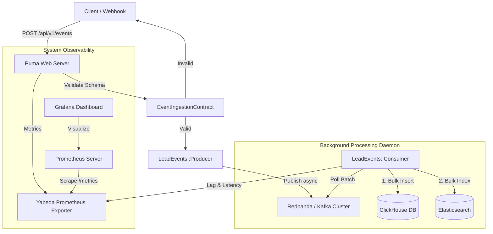

# High-Volume Lead Event Streaming & Ingestion Engine
[](https://github.com/AugustoPresto/lead-streaming-service/actions/workflows/ci.yml)
[](https://www.ruby-lang.org/)
[](https://rubyonrails.org/)

An enterprise-grade, distributed, and highly available Ruby on Rails API microservice designed to ingest, validate, and process massive volumes of lead events. Engineered to guarantee low-latency, consistency, and analytical write-throughput, achieving data availability for segmentation and querying under the **5-minute SLA**.

---

## 1. System Architecture

The service uses a decoupled, event-driven architecture (EDA). The ingestion layer is completely separated from the storage engines via an asynchronous broker.



### Ingestion Path
1. **Ingestion API**: A Rails controller receives event requests, validates them synchronously, and registers a transaction-less publish command.
2. **Event Schema Validation**: Uses `dry-validation` to validate the incoming structure (checking strict UUIDs, ISO8601 formatting, and payloads).
3. **Queue Ingestion**: The event is pushed to a Kafka topic (`lead-events`), partitioned by `lead_id` to guarantee message ordering for individual leads.
4. **HTTP 202 Accepted Response**: Rails returns immediately to the client, guaranteeing ultra-low ingestion latency (<10ms).

### Analytical Storage Path
1. **Background Consumer**: A multi-threaded, long-running daemon polls Kafka for messages.
2. **Buffer & Batch Processing**: Messages are accumulated in batches (up to 1,000 messages or 2 seconds buffer time) to avoid analytical write overhead.
3. **Columnar Database (ClickHouse)**: The consumer executes a bulk insertion into ClickHouse for raw analytics.
4. **Inverted Index (Elasticsearch)**: The consumer indexes events into Elasticsearch for fast real-time search and filter segmentations.
5. **Manual Offset Committing**: Once both databases confirm successful writes, the consumer commits the Kafka offset, guaranteeing **at-least-once delivery** and no data loss.

---

## 2. Storage & Database Schema Design

### ClickHouse Columnar Schema
ClickHouse is optimized for heavy write throughput and sequential analytical scans. Events are partition-grouped by month and deduplicated using the `ReplacingMergeTree` engine.

```sql
CREATE TABLE rd_analytics.lead_events (
    event_id UUID,
    lead_id UUID,
    company_id Nullable(UUID),
    event_type LowCardinality(String),
    payload String,
    created_at DateTime64(3, 'UTC'),
    processed_at DateTime64(3, 'UTC')
) ENGINE = ReplacingMergeTree(processed_at)
PARTITION BY toYYYYMM(created_at)
PRIMARY KEY (event_id)
ORDER BY (event_id, lead_id, event_type, created_at)
SETTINGS index_granularity = 8192;
```
* **Deduplication Engine**: `ReplacingMergeTree(processed_at)` ensures that if a network partition triggers a Kafka retry, duplicate events are discarded in the background during merges, maintaining consistency.
* **LowCardinality**: Applying `LowCardinality` to `event_type` optimizes storage compression and scan speeds since event types are highly repetitive.
* **Partitioning**: Partitioning by month (`toYYYYMM(created_at)`) allows for efficient data retention management and query pruning.

### Elasticsearch Inverted Index Schema
Elasticsearch indexes lead events to support complex real-time search queries (e.g., "leads belonging to company X who performed action Y in the last 2 days").

```json
{
  "mappings": {
    "properties": {
      "event_id": { "type": "keyword" },
      "lead_id": { "type": "keyword" },
      "event_type": { "type": "keyword" },
      "timestamp": { "type": "date" },
      "properties": {
        "type": "object",
        "dynamic": true
      }
    }
  }
}
```

---

## 3. Observability & Health Monitoring

Observability is embedded directly into the application code:
* **Prometheus Metrics (`Yabeda`)**:
  * `rd_marketing_events_ingested_total`: Tracks the ingestion rate labeled by `event_type`.
  * `rd_marketing_validation_failures_total`: Monitors bad data attempts.
  * `rd_marketing_clickhouse_bulk_insert_latency_seconds`: Measures analytical database insert duration.
  * `rd_marketing_elasticsearch_bulk_index_latency_seconds`: Measures search index speed.
* **Health Checks**: A standard `/up` endpoint checks if core internal frameworks are online.
* **Sentry Integration**: Global error handlers catch pipeline crashes, automatically forwarding tracebacks to Sentry.

---

## 4. API Specification

### Event Ingestion Endpoint
* **Method**: `POST`
* **Path**: `/api/v1/events`
* **Content-Type**: `application/json`

#### Request Body Example
```json
{
  "event_id": "9b1deb4d-3b7d-4bad-9bdd-2b0d7b3dcb6d",
  "lead_id": "a0eebc99-9c0b-4ef8-bb6d-6bb9bd380a11",
  "event_type": "conversion",
  "timestamp": "2026-06-26T12:00:00.000Z",
  "properties": {
    "company_id": "e9a04a60-a299-4674-8b63-125464ad396a",
    "conversion_page": "landing-page-ebook-rails",
    "value": 150.00
  }
}
```

#### Response (Success - 202 Accepted)
```json
{
  "event_id": "9b1deb4d-3b7d-4bad-9bdd-2b0d7b3dcb6d",
  "status": "accepted",
  "message": "Event successfully queued for ingestion."
}
```

#### Response (Schema Validation Failure - 422 Unprocessable Content)
```json
{
  "errors": {
    "event_id": ["must be a valid UUID"],
    "timestamp": ["must be a valid ISO8601 datetime string"]
  }
}
```

---

## 5. Kubernetes & Production Deployment

In a production environment, the service is packaged into Docker containers and run on Kubernetes:
* **Horizontal Pod Autoscaling (HPA)**:
  * The `web` (API) service autoscales based on CPU/Memory usage (target: 70% CPU utilization).
  * The `consumer` daemon service autoscales based on **Kafka Consumer Lag** (using KEDA - Kubernetes Event-driven Autoscaling).
* **Resource Allocation Rules**:
  * Enforce strict CPU/Memory requests and limits (`resources.limits.memory` and `resources.requests.cpu`) to prevent resource starvation.

---

## 6. How to Run Locally (Computer-Safe Setup)

This project has been explicitly designed to prevent local system lockups. Real Kafka, Clickhouse, and Elasticsearch services are disabled in development by default via **Mock Adapters** that log payload actions and use in-memory test queues.

### Prerequisites
* Ruby 3.2.2 (RVM recommended)
* Bundler

### Setup
1. Clone the repository and go to the project directory:
   ```bash
   cd AugustoPresto/lead-streaming-service
   ```
2. Install Gem dependencies locally (without Docker):
   ```bash
   bundle install
   ```

### Running the Test Suite (RSpec)
Execute the fast unit and integration tests (ActiveRecord connection has been completely decoupled, allowing database-free testing):
```bash
bundle exec rspec
```

### Running the Local Web Server
Start the Puma web server:
```bash
bundle exec rails server
```
Test the endpoint via cURL:
```bash
curl -X POST http://localhost:3000/api/v1/events \
  -H "Content-Type: application/json" \
  -d '{
    "event_id": "a0eebc99-9c0b-4ef8-bb6d-6bb9bd380a11",
    "lead_id": "550e8400-e29b-41d4-a716-446655440000",
    "event_type": "newsletter_signup",
    "timestamp": "2026-06-26T12:00:00Z",
    "properties": { "company_id": "770e8400-e29b-41d4-a716-446655440000" }
  }'
```
You will get a `202 Accepted` response. Check `log/development.log` to see the Mock Producer logs.

### Running the React Frontend Dashboard
To run the interactive simulator and mock database inspector:
1. Navigate to the `frontend` folder:
   ```bash
   cd frontend
   ```
2. Install npm dependencies (if not already done):
   ```bash
   npm install
   ```
3. Start the Vite dev server:
   ```bash
   npm run dev
   ```
4. Open your browser and navigate to `http://localhost:5173`. You will see the event simulator, pipeline visualizer, and live mock database tables.

---

## 8. Running with Full Docker Stack (Optional)
If you wish to spin up the actual Redpanda, Clickhouse, Elasticsearch, and Prometheus servers, ensure you have Docker installed and run:
```bash
docker-compose up --build
```
*Observe: Running the full stack requires significant RAM/CPU. If your system has less than 16GB of RAM, stick to the default Local Mock environment.*
