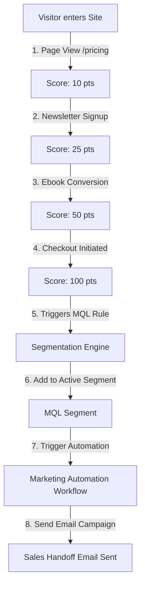
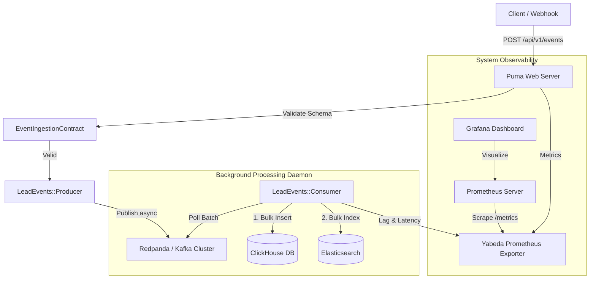

# Marketing Lead Operations & Automation Engine (RD Station & HubSpot Model)
[](https://github.com/AugustoPresto/lead-streaming-service/actions/workflows/ci.yml)
[](https://www.ruby-lang.org/)
[](https://rubyonrails.org/)

An enterprise-ready lead management and marketing automation platform designed to capture, score, and segment customer actions in real-time. Engineered to support high-velocity marketing operations similar to **RD Station** and **HubSpot**, this engine enables growth teams to turn anonymous website visitors into qualified opportunities and trigger automated campaigns under a **5-minute data SLA**.

---

## ⚡ Deployed Live Demo (Fly.io)

Experience the application running live in production:
👉 **[https://lead-streaming-api-augusto.fly.dev/](https://lead-streaming-api-augusto.fly.dev/)**

> [!NOTE]
> **Active Real-Time Simulation:** The application runs a lightweight background simulation engine on Fly.io that automatically streams new lead journeys (Newsletter Signups, Pricing Page Views, Checkout Actions) every 5–10 minutes. This mimics a steady, realistic production traffic baseline. Upon opening the dashboard, you will watch live events flow, lead scores update dynamically, and automation workflows trigger in real-time.

---

## 1. Core Marketing & Operations Features

This platform provides business-ready interfaces and workflows to help growth, marketing, and sales operations teams run real-time campaigns:

### 🎯 Dynamic Lead Scoring System
Every action taken by a contact dynamically updates their profile and increments their **Lead Score**. This score acts as a real-time indicator of buying intent and sales readiness:
* **Page View** (`page_view` on `/pricing` or `/features`): Indicates prospect is researching options. **(+10 pts)**
* **Newsletter Signup** (`newsletter_signup`): Captures basic subscriber permission. **(+15 pts)**
* **Form Conversion** (`conversion` on an eBook / Whitepaper): Demonstrates content engagement. **(+25 pts)**
* **Checkout Initiated** (`add_to_cart`): Indicates high buying intent. **(+50 pts)**

### 📈 Advanced Segmentation Engine
Define active lists and rule-based segments that update in real-time. Growth teams can immediately target contacts matching these rules:
1. **Marketing Qualified Leads (MQLs)**: Contacts whose cumulative Lead Score is $\ge$ 75 points. Ready for sales handoff.
2. **High Buying Intent**: Contacts who initiated an e-commerce checkout.
3. **Engaged Subscribers**: Newsletter subscribers who also visited the pricing page.

### ⏳ Customer Journeys & Timelines
Clicking on any contact in the database inspector renders a chronological **Activity Timeline**. Sales representatives can inspect this journey to understand the contact's interest and history before starting outreach.

### ⚡ HubSpot-Style Marketing Dashboard & Automation Builder
An interactive React dashboard (`http://localhost:5173`) that lets marketing operators:
* Select preset customer actions (Newsletter Signup, Pricing Page View, eBook Conversion, Checkout).
* Auto-generate high-throughput events to simulate massive marketing campaigns (1 to 10 events/second).
* **Create Automation Workflows**: Define active HubSpot-style workflows using triggers (MQL qualification, Newsletter signup, E-commerce Checkout) and actions (Send welcome email, POST webhook to Pipedrive CRM, assign Sales representative).
* **Live Logs Console**: Monitor live execution logs step-by-step as automation campaigns process streaming events.
* **Conversion Funnel Analytics**: Dynamic conversion metrics aggregating Visitors -> Subscribers -> Qualified -> MQLs with conversion rates updated on ClickHouse event bulk-writes.
* **Pipeline SLA Latency Monitor**: Real-time monitoring of average consumer processing times (ingestion latency between event `timestamp` and consumer `processed_at`) keeping track of SLA compliance.

---

## 2. Business Flow & Lifecycle Use Case

To illustrate how events translate into automated marketing workflows, here is a typical customer journey:



### Example Lifecycle:
1. **Research Phase**: *Ana Silva* visits the pricing page. An event (`page_view`) is captured, giving her **10 points**.
2. **Permission Phase**: *Ana* signs up for the newsletter. Her profile is enriched with her email (`ana.silva@agenciadigital.com`), and her score rises to **25 points**.
3. **Engagement Phase**: *Ana* downloads a marketing eBook. A `conversion` event is registered, raising her score to **50 points**.
4. **Buying Intent**: *Ana* adds a product plan to her cart. The `add_to_cart` event gives her **50 points**, pushing her total score to **100 points**.
5. **Campaign Trigger**: The **Segmentation Engine** detects her score is $\ge$ 75, qualifies her as an **MQL**, and triggers an automated email campaign offering a direct sales call.

---

## 3. How to Run & Verify Locally

### 1. Start the Rails API Backend
Ensure you have Ruby 3.2.2 (RVM recommended) and Bundler installed, then execute:
```bash
bundle install
bundle exec rails server -p 3000
```

### 2. Start the React Frontend Dashboard
In a separate terminal, navigate to the `frontend` folder, install npm dependencies, and start Vite:
```bash
cd frontend
npm install
npm run dev
```
Open `http://localhost:5173` in your browser.

### 3. Generate Simulated Campaigns & Automations
1. On the left side of the dashboard, locate the **High-Throughput Stream Generator** card.
2. Click **Start Auto-Stream Generator** at **5 e/s** or **10 e/s** to simulate real-time traffic.
3. Select the **Segmentation Engine** tab in the database inspector to see contacts being grouped automatically into segments like **MQLs** as their scores increase!
4. Select the **Automation Workflows** tab to activate/toggle automation flows (e.g. Sales Handoff) and watch live execution logs (email dispatch, CRM webhooks) trigger in real-time as users stream in!
5. Select the **Analytics & Performance DB (ClickHouse)** tab to inspect the conversion funnel and real-time SLA ingestion latency!

---

## Appendix: Technical Architecture & Specs

Under the hood, the engine is designed for high-availability, low-latency, and high write-throughput using a decoupled, event-driven architecture (EDA):



### Database Schemas & Storage Design

#### ClickHouse Columnar Store (Analytics)
Raw events are bulk-inserted into ClickHouse using the `ReplacingMergeTree` engine, which handles deduplication and monthly partitions:
```sql
CREATE TABLE rd_analytics.lead_events (
    event_id UUID,
    lead_id UUID,
    company_id Nullable(UUID),
    event_type LowCardinality(String),
    payload String,
    created_at DateTime64(3, 'UTC'),
    processed_at DateTime64(3, 'UTC')
) ENGINE = ReplacingMergeTree(processed_at)
PARTITION BY toYYYYMM(created_at)
PRIMARY KEY (event_id)
ORDER BY (event_id, lead_id, event_type, created_at)
SETTINGS index_granularity = 8192;
```

*Analytical Query Example (ClickHouse)*:
```sql
SELECT
    JSONExtractString(payload, 'referrer') AS traffic_source,
    count(event_id) AS total_events,
    countIf(event_type = 'conversion') AS conversions,
    round(conversions * 100.0 / total_events, 2) AS conversion_rate_percentage
FROM rd_analytics.lead_events
WHERE created_at >= now() - INTERVAL 7 DAY
GROUP BY traffic_source
ORDER BY total_events DESC;
```

#### Elasticsearch Inverted Index (Search & Segmentation)
Elasticsearch indexes dynamic contact attributes to support sub-second filters on search queries:
```json
{
  "mappings": {
    "properties": {
      "event_id": { "type": "keyword" },
      "lead_id": { "type": "keyword" },
      "event_type": { "type": "keyword" },
      "timestamp": { "type": "date" },
      "properties": {
        "type": "object",
        "dynamic": true
      }
    }
  }
}
```

* **Intelligent Search API (`GET /api/v1/events/search?q=...`)**:
  * Utilizes Elasticsearch Query DSL with full-text **Multi-Match** queries across contact name, email, company, and path fields.
  * Implements **Relevance Boosting** (prioritizing name/email match values higher than company names) and **Typo Tolerance (Fuzzy Search)** with `fuzziness: "AUTO"`.
  * Simulated in mock mode using a **token-based Levenshtein distance matching algorithm** to replicate standard token analyzer behavior.

### Observability & Infrastructure
* **Yabeda Prometheus Exporter**: Exposes custom metrics for validation failures, event counts, and ClickHouse/Elasticsearch insertion latencies.
* **Kubernetes HPA & KEDA**: Configured to autoscale Puma pods based on CPU and worker daemons based on Redpanda consumer lag.
* **Docker Compose**: Pre-configured stack available via `docker-compose up --build` for actual Kafka, ClickHouse, and Elasticsearch cluster verification.
