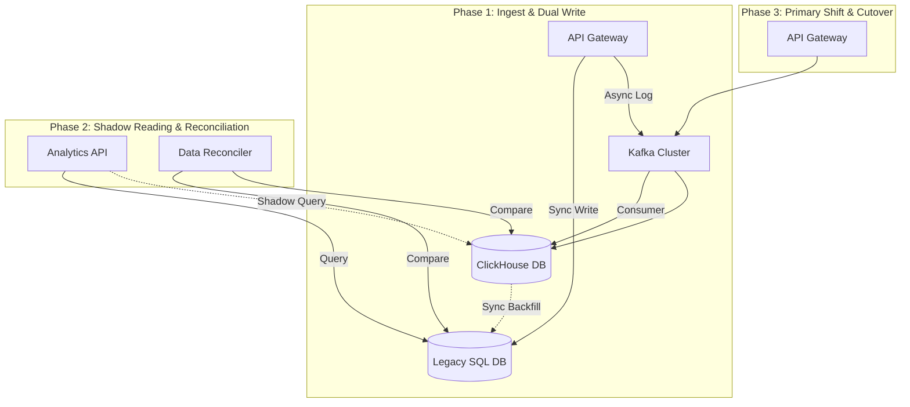

# Architecture Migration & Legacy Refactoring Plan
**Role Focus: Senior Backend Engineer / Tech Lead**

## Context & Objectives
The legacy system currently processes lead events synchronously by writing directly to a transactional database (e.g., PostgreSQL/MySQL). As the volume of leads and events grows (exceeding tens of millions daily), this direct-write approach causes:
1. **DB Lockups & Connection Exhaustion**: Spikes in traffic block standard HTTP requests.
2. **High Latency**: Ingestion takes hundreds of milliseconds due to indexing and transactions.
3. **Siloed Analytics**: Analytical queries degrade operational application database performance.

The target architecture introduces a **decoupled event-driven streaming pipeline** using Kafka, ClickHouse (for analytics), and Elasticsearch (for search/segmentation). The challenge is migrating this core logic with **zero downtime**, **zero data loss**, and within the **5-minute data availability SLA**.

---

## 1. High-Level Migration Strategy: Phased Transition

We will use a **four-phase double-writing pattern** to safely migrate traffic.

### Phase 1: Dual Writing (Dark Launch)
* **Goal**: Establish the streaming pipeline and populate the analytical databases without using them as the source of truth yet.
* **Execution**:
  1. Update the legacy ingestion endpoint to publish events to Kafka *asynchronously* (non-blocking) in a `rescue` block so that any Kafka/broker failure does not impact the legacy write.
  2. Implement the `LeadEvents::Consumer` daemon to pull events from Kafka and bulk-insert them into ClickHouse and Elasticsearch.
  3. Keep the user-facing query APIs pointing to the Legacy database.

### Phase 2: Shadow Reading & Reconciliation
* **Goal**: Validate the consistency and performance of ClickHouse and Elasticsearch under production load.
* **Execution**:
  1. Build a background verification task (Data Reconciler) to check if ClickHouse matches the legacy database records within the 5-minute window.
  2. Query performance testing: Execute reads against both ClickHouse/ES and the legacy database, comparing response times and payloads.
  3. Target: ClickHouse data consistency > 99.999% and P99 query latency < 100ms.

### Phase 3: Traffic Switchover (Query Cutover)
* **Goal**: Shift read queries to the new analytical databases.
* **Execution**:
  1. Point the Segment and Leads analytics services to read from ClickHouse and Elasticsearch.
  2. Maintain dual-writing so that we have an immediate rollback capability to the legacy SQL database.

### Phase 4: Full Decoupling (Decommissioning)
* **Goal**: Completely remove legacy synchronous database dependencies.
* **Execution**:
  1. Remove the direct write logic from the API ingestion layer.
  2. Ingestion layer now strictly routes to Kafka (returning `202 Accepted` immediately).
  3. Archive the legacy event database tables.

---

## 2. Zero-Downtime Execution & Fallback Plan

| Risk | Mitigation | Rollback Action |
| :--- | :--- | :--- |
| **Kafka cluster goes down during Phase 1/2** | Ingestion Controller wraps publishing in a rescue block. Falls back to writing to a local Redis buffer or logs to disk. | Disable the Kafka publishing flag via feature toggle; traffic continues normally to the Legacy DB. |
| **ClickHouse writes fail/lag** | Consumer raises an exception and does not commit the offset. Kafka automatically re-delivers the batch. | Point analytics queries back to the Legacy DB via feature flag while consumer lag is resolved. |
| **Data Discrepancy detected** | The reconciliation worker identifies missing lead events and triggers a selective backfill script from the Legacy DB. | Pause read cutover; debug schema replication, update the `ReplacingMergeTree` version parameter. |

---

## 3. Engineering Mentorship & Squad Alignment

To ensure a smooth transition, the team will be mentored and aligned using these practices:

1. **Decoupled Development**:
   * Junior developers will work on schema validation contracts (e.g., adding properties to `EventIngestionContract`) and RSpec testing, keeping them isolated from Kafka cluster operations.
2. **Runbooks & Local Mocking**:
   * Ensure developers use the `MOCK_KAFKA=true` and `MOCK_CLICKHOUSE=true` flags during daily development to avoid local CPU/RAM starvation.
3. **Pair Programming & Code Review Focus**:
   * Focus code reviews on **idempotency** (ensuring a consumer can process the same message multiple times without duplicating data) and **connection pooling** (verifying ClickHouse connections are kept alive and reused).
